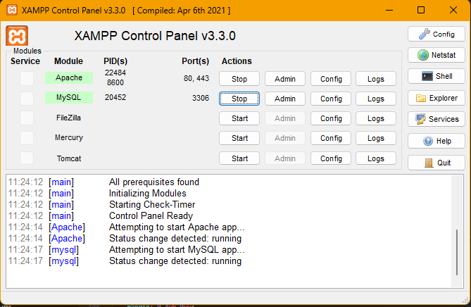

# STAGE-BUT-2023
Stage du 15 avril au 15 juin 2023
Refonte du site web http://anrh.dz/

# Consigne d'installation WINDOWS

## Pour faire marcher le site :
### 
 **Installer XAMPP & le démarrer** 

    + installer un serveur PHP (dans cette exemple je prendrais XAMPP)
    + ouvrir le Control Panel
    + demarrer le serveur Apache et MySQL (img si dessous)

### 
 **Créer sa base de donnée** 

### 
 **En cas d'erreurs** 

## Pour faire marcher les cartes & geoserver :
### 
 **Créer sa base de donnée POSTGRESQL** 

### 
 **Installer QGIS, PG ADMIN4 & geoserver** 
